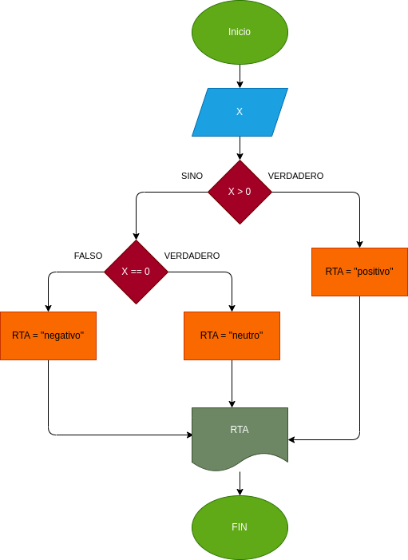

# Positivo-o-negativo
Programa para verificar si un numero es positivo o negativo

## Designar si un numero se positivo o negativo dependiendo de su posicion en la tabla numerica

# Analisis

-Variable de entrada

x: Es el numero que se ingresa para determinar si es negativo o positivo

-Variable de salida

 Diseño
 

# Contruccion

ejercicio N.6 implementar el programa para saber si es un numero positivo o negativo

x>0:El numero es positivo
x<0:El numero es negativo
x==0:El numero es neutro
## ESTE PROGRAMA ESTA ESCRITO EN LENGUAJE MARKDOWN